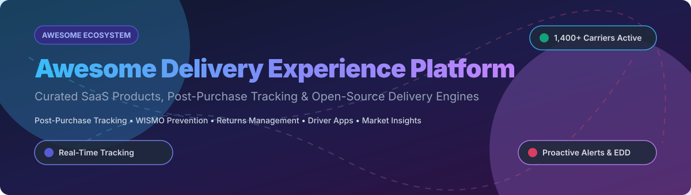

  

# 🚚 Awesome Delivery Experience Platform

    

## 🌐 Top Delivery Experience Platforms Ecosystem

**Curated List of SaaS Products & Open-Source GitHub Projects**

*Focused on Post-Purchase Tracking, Proactive Notifications, Returns Management & Branded Delivery Experiences*

**Last updated: October 2026**

---

### 🔍 Overview & Market Context

This repository tracks notable **SaaS platforms** and **open-source projects** for **Delivery Experience**. These tools help e-commerce brands reduce **WISMO** ("Where Is My Order?") tickets, provide proactive shipment notifications, turn post-purchase customer interactions into branded marketing surfaces, and optimize local courier dispatch.

**Examples** include Route, AfterShip, Narvar, parcelLab, Wonderment, Malomo, Track123, ShippyPro, Shipup, and Ordertracker.

**Open-source emphasis**: The post-purchase sector is commercially dominated by proprietary platforms due to carrier network integrations. However, powerful open-source projects exist for GPS tracking, local delivery driver dispatch, and self-hosted order management.

---

## 📑 Table of Contents

- [🏢 SaaS/Hosted Platforms](#-saashosted-platforms)
- [🔓 Open-Source GitHub Projects](#-open-source-github-projects)
- [📈 Star History](#-star-history)
- [🤝 How to Contribute](#-how-to-contribute)
- [💖 Support & Sponsorship](#-support--sponsorship)
- [⚠️ Disclaimer](#%EF%B8%8F-disclaimer)

---

## 🏢 SaaS/Hosted Platforms

### 📊 Market Size & Industry Structure

> **💡 Market Overview & Fragmented Landscape:**
> The global **Post-Purchase Software & Delivery Experience** market size is estimated at **$2.5 Billion** (2024–2026) and is projected to reach **$7.8 Billion by 2033** at a **14.2% CAGR**. 
> The sector is **highly fragmented** with low overall vendor concentration. Rather than a single "winner-take-all" dominant player, the market features heavy regional diversity, carrier-network specialization, and active M&A consolidation (e.g., Redo acquiring Malomo, Loop acquiring Wonderment, Route acquiring Frate).

Below is a comparison of top proprietary post-purchase and delivery experience SaaS solutions, sorted by **Valuation / Annual Revenue (Descending)**:

| Platform | Valuation / Company Size | Pricing (Starting Tier) | Free Tier / Free Trial Limits | Key Highlights & Description |
| :--- | :--- | :--- | :--- | :--- |
| **[Route](https://route.com/)** | **$1.4 Billion** Valuation (Series C Unicorn) | $0.00 base cost (100% merchant-free model; funded by $0.98+ optional buyer-paid package protection) | **Free Forever Plan** ($0 merchant fee; unlimited tracking up to optional consumer add-on coverage) | Package tracking and shipping protection platform. Provides real-time tracking, AI package protection, and returns. Acquired Frate in Jan 2026. |
| **[Narvar](https://www.narvar.com/)** | **~$100M+** ARR (~$1B+ Valuation est.) | $2,500/month ($30,000/year base contract) | **No Free Tier / No Public Free Trial** (Sales-demo & enterprise pilot program only) | Enterprise incumbent post-purchase platform (Track, Promise AI EDD, Shield Returns). Connects 300+ carrier accounts with 2-3 year contracts. |
| **[AfterShip](https://www.aftership.com/)** | **~$50M–$100M** Revenue | $9.00/month (Essentials plan for up to 100 shipments/mo) | **Free Forever Plan** (50 shipments/month with standard tracking & notification emails) | The most widely adopted tracking platform. 1,400+ carrier network with AI-driven Estimated Delivery Dates (EDD) and returns management. |
| **[parcelLab](https://parcellab.com/)** | **~$30M–$50M** Revenue | $499/month (Growth tier starting price) | **No Free Tier** (14-Day Free Trial available upon sales request) | Communications-led post-purchase platform organized around Convert, Engage, Retain, and Insights. Proactive carrier-triggered alerts reduce WISMO by 40%+. |
| **[ShippyPro](https://www.shippypro.com/)** | **~$10M–$20M** Revenue | €29/month (Fast Growing plan for 250 orders/mo) | **30-Day Free Trial** (Includes 30 free shipments/orders with full API access) | European shipping & delivery management platform with tracking, label generation, and automated returns. |
| **[Malomo](https://gomalomo.com/)** | **~$5M–$10M** Revenue (Acquired by Redo 2026) | $99/month (Starter tier for up to 1,000 shipments/mo) | **14-Day Free Trial** (Unlimited tracking page views during 14-day trial period) | Turns shipment tracking into a marketing channel with customized tracking pages for Shopify & Klaviyo. Acquired by Redo in Jan 2026. |
| **[Wonderment](https://wonderment.com/)** | **~$5M–$10M** Revenue (Acquired by Loop 2026) | $99/month (Base tier for 1,000 shipments/mo) | **14-Day Free Trial** (Up to 250 tracked shipments during trial period) | Proactive shipping notifications to prevent WISMO tickets and track stalled shipments. Acquired by Loop Returns in Mar 2026. |
| **[Shipup](https://www.shipup.co/)** | **~$5M–$10M** Revenue | €79/month (Starter plan for 500 shipments/mo) | **14-Day Free Trial** (100 free tracked shipments during 14-day trial) | Post-purchase customer experience platform focused on proactive notifications, customer satisfaction surveys, and branded tracking. |
| **[Track123](https://track123.com/)** | **~$1M–$5M** Revenue | $9.00/month (Growth plan for 100 shipments/mo) | **Free Forever Plan** (100 shipments/month free with branded tracking page & auto sync) | Shopify-native order tracking and delivery experience platform with 1,000+ carrier integrations and multi-language support. |
| **[Ordertracker](https://ordertracker.com/)** | **~$1M–$5M** Revenue | $9.99/month (Pro plan for 200 order lookups/mo) | **Free Forever Plan** (30 order lookups/month with global multi-carrier tracking) | Universal e-commerce order tracking platform supporting 1,200+ global couriers and auto-detect routing. |

---

## 🔓 Open-Source GitHub Projects

Below are top open-source projects for GPS vehicle tracking, logistics management, order tracking, and WooCommerce delivery, sorted by **GitHub Stars (Descending)**:

### 🌟 Open-Source Repository Ranking

- **[Traccar](https://github.com/traccar/traccar)** 
  - **Description**: Leading open-source GPS tracking platform supporting 200+ GPS protocols and 2,000+ device models. Ideal for real-time fleet management, delivery vehicle tracking, and geofencing.
  - **Tech Stack**: Java, MySQL/PostgreSQL, React Web UI

- **[Fleetbase Core](https://github.com/fleetbase/fleetbase)** 
  - **Description**: Open-source logistics operations platform & API infrastructure for fleet dispatch, order management, driver routing, and real-time tracking.
  - **Tech Stack**: PHP (Laravel), Ember.js, MySQL, Docker

- **[Enatega Multivendor Delivery](https://github.com/enatega/food-delivery-multivendor)** 
  - **Description**: Open-source full-stack delivery management ecosystem with mobile apps for drivers, customer tracking, and admin dispatch dashboard.
  - **Tech Stack**: React Native, Node.js, GraphQL, MongoDB

- **[Delivery Tracker](https://github.com/shlee322/delivery-tracker)** 
  - **Description**: Open-source shipping carrier tracking API engine providing unified GraphQL interfaces across multiple delivery services.
  - **Tech Stack**: TypeScript, Node.js, GraphQL

- **[LocalPilot](https://github.com/racmanuel/localpilot)** 
  - **Description**: WooCommerce plugin adding local delivery driver dispatch, mobile web interface for drivers, photo proof of delivery, and Mapbox routing.
  - **Tech Stack**: PHP, WordPress/WooCommerce, Mapbox API

- **[Fleetbase WooCommerce Plugin](https://github.com/fleetbase/woocommerce)** 
  - **Description**: Official Fleetbase integration for WooCommerce enabling automatic order sync, checkout shipping rate calculations, and tracking shortcodes.
  - **Tech Stack**: PHP, WooCommerce REST API

- **[OrderEase](https://github.com/khdxsohee/OrderEase)** 
  - **Description**: Lightweight PHP & MySQL web application for managing product order statuses and customer tracking portals with unique order IDs.
  - **Tech Stack**: PHP 7.4+, MySQL, Bootstrap

- **[Tracking System PHP/MySQL](https://github.com/khdxsohee/tracking-system-php-mysql)** 
  - **Description**: Simple order tracking portal with 6-character lookup codes, payment status tracking, and color-coded delivery milestones.
  - **Tech Stack**: PHP, MySQL

- **[Real-Time Orders](https://github.com/molxno/real-time-orders)** 
  - **Description**: Laravel 12 order management system utilizing WebSockets (Pusher/Echo) for live order updates and push notifications.
  - **Tech Stack**: PHP (Laravel 12), Livewire, Tailwind CSS, Pusher

---

## 📈 Star History

---

## 🤝 How to Contribute

Contributions are welcome and appreciated! Follow these steps to contribute:

1. **Fork** this repository.
2. **Create a branch** for your update (`git checkout -b feature/add-new-platform`).
3. **Add/Edit entries** in `README.md` following the tabular or ranked format.
4. **Submit a Pull Request** with a brief summary of additions.

Please review curated tools against our quality criteria (factual pricing, valid links, active repositories).

---

## 💖 Support & Sponsorship

If you find this repository useful for your e-commerce platform research or delivery engineering project:

- ⭐ **Star this repository** to help others discover it!
- 🔀 **Fork & Share** with your team and network.
- ☕ **Buy me a coffee / Sponsor**: If you'd like to support open-source maintenance, check out the [GitHub Sponsor Dashboard](https://github.com/sponsors/ishandutta2007).

Thank you for supporting open-source logistics tools and transparent SaaS curation! ❤️

---

## ⚠️ Disclaimer

- This list is **community-curated** for informational purposes and does not constitute an endorsement.
- Delivery experience platforms handle customer personal data and logistics privacy; verify compliance with GDPR, CCPA, and regional laws.
- **Open-Source vs Commercial Reality**: Open-source options (e.g. Traccar, Fleetbase) excel at fleet routing and local dispatch. Proprietary SaaS platforms (AfterShip, Narvar) provide thousands of direct carrier EDI/API integrations that open-source tools cannot replicate without custom carrier connections.

---

  Made with ❤️ for e-commerce ops teams, logistics engineers, and product leaders.

